# Claude Code Project Bootstrap

## Overview

Set up a complete Claude Code project from scratch — GitHub repo, README, hooks, file protection, build-gated commits, secret scanning, auto-formatting, and git workflow conventions. Works for any stack.

## When to Use

- Starting a new project that will use Claude Code
- Adding guardrails to an existing project
- User asks about protecting files, blocking commands, or enforcing builds
- User wants to replicate hooks/workflow from another project
- User wants to create a GitHub repo for a project

## Bootstrap Flow

```dot
digraph bootstrap {
  rankdir=LR;
  "Has git repo?" [shape=diamond];
  "Init git + GitHub repo" [shape=box];
  "Has README?" [shape=diamond];
  "Generate README" [shape=box];
  "Create hooks + settings" [shape=box];
  "Write CLAUDE.md" [shape=box];
  "Initial commit + push" [shape=box];

  "Has git repo?" -> "Init git + GitHub repo" [label="no"];
  "Has git repo?" -> "Has README?" [label="yes"];
  "Init git + GitHub repo" -> "Has README?";
  "Has README?" -> "Generate README" [label="no"];
  "Has README?" -> "Create hooks + settings" [label="yes"];
  "Generate README" -> "Create hooks + settings";
  "Create hooks + settings" -> "Write CLAUDE.md";
  "Write CLAUDE.md" -> "Initial commit + push";
}
```



## Step 1: Git + GitHub Repo

Skip if the project already has a git repo and remote.

### New repo from existing directory

```bash
cd your-project
git init
```

### Create GitHub repo

Ask the user for visibility preference (public/private). Default to private.

```bash
# Private (default)
gh repo create <repo-name> --private --source=. --push

# Public
gh repo create <repo-name> --public --source=. --push

# With description
gh repo create <repo-name> --private --source=. --push --description "Short project description"
```

**If the directory is empty (brand new project):**
```bash
mkdir <project-name> && cd <project-name>
git init
gh repo create <repo-name> --private --source=. --push
```

### .gitignore

If no `.gitignore` exists, create one appropriate for the stack. Always include:

```gitignore
# Claude Code (user-specific, not shared)
.claude/settings.local.json

# Secrets
.env
.env.*
*.key
*.pem

# OS
.DS_Store
Thumbs.db
```

Add stack-specific entries (node_modules, __pycache__, target/, build/, etc.).

## Step 2: README

If no `README.md` exists, generate one. Ask the user for project context or infer from existing files.

````markdown
# Project Name

Brief description of what this project does.

## Getting Started

### Prerequisites
- List dependencies and tools needed

### Installation
```
# Installation commands
```

### Development
```
# How to run locally
```

### Testing
```
# How to run tests
```

## Project Structure

```
overview of key directories and files
```

## Contributing

This project uses [Claude Code](https://claude.ai/claude-code) with automated guardrails:
- Destructive git commands are blocked (force push, reset --hard, etc.)
- Commits are gated behind passing builds and tests
- Sensitive files (.env, credentials) are protected from accidental writes
- Conventional commits enforced: `<type>(<scope>): <subject>`
- Secrets are scanned on every file write
- Code is auto-formatted on save (if formatters are installed)

See `CLAUDE.md` for full development workflow.

## License

[Choose appropriate license]
````

**Adapt the README** to the actual project — don't use the template verbatim. Fill in real values from the codebase, package.json, Cargo.toml, go.mod, etc.

## Step 3: Directory Structure

```
your-project/
├── .claude/
│   ├── hooks/
│   │   ├── validate-bash.sh      # blocks destructive commands, gates commits
│   │   ├── protect-files.sh      # blocks writes to sensitive files
│   │   ├── build-check.sh        # auto-detects stack, runs build + tests
│   │   ├── scan-secrets.sh       # warns on hardcoded secrets in written files
│   │   ├── session-check.sh      # verifies hooks setup on session start
│   │   └── auto-format.sh        # formats files after write (if formatters installed)
│   ├── statusline.sh              # context window monitor (progressive color)
│   ├── settings.json             # hook wiring + statusline (committed to git)
│   └── settings.local.json       # user allow-list (NOT committed)
├── .gitignore
├── README.md
└── CLAUDE.md                      # project instructions
```

## Step 4: Hook System

Hooks are shell scripts triggered by Claude Code's tool lifecycle. They read JSON from stdin and control execution via exit codes:

| Exit | Meaning |
|------|---------|
| `0` | Allow |
| `1` | Soft block (retry possible) |
| `2` | Hard block (denied) |

### settings.json (commit this)

```json
{
  "hooks": {
    "PreToolUse": [
      {
        "matcher": "Bash",
        "hooks": [{"type": "command", "command": "\"$CLAUDE_PROJECT_DIR\"/.claude/hooks/validate-bash.sh", "timeout": 10}]
      },
      {
        "matcher": "Write|Edit",
        "hooks": [{"type": "command", "command": "\"$CLAUDE_PROJECT_DIR\"/.claude/hooks/protect-files.sh", "timeout": 10}]
      }
    ],
    "PostToolUse": [
      {
        "matcher": "Write|Edit",
        "hooks": [
          {"type": "command", "command": "\"$CLAUDE_PROJECT_DIR\"/.claude/hooks/scan-secrets.sh", "timeout": 10},
          {"type": "command", "command": "\"$CLAUDE_PROJECT_DIR\"/.claude/hooks/auto-format.sh", "timeout": 15}
        ]
      }
    ],
    "SessionStart": [
      {
        "hooks": [{"type": "command", "command": "\"$CLAUDE_PROJECT_DIR\"/.claude/hooks/session-check.sh", "timeout": 5}]
      }
    ]
  }
}
```

### validate-bash.sh

Blocks destructive commands, validates commits and branches, gates commits behind passing builds.

```bash
#!/bin/bash
INPUT=$(cat)
COMMAND=$(echo "$INPUT" | jq -r '.tool_input.command // empty')
[ -z "$COMMAND" ] && exit 0

# === Universal blocks (with helpful alternatives) ===
if echo "$COMMAND" | grep -qE 'rm\s+(-rf|--recursive\s+--force)'; then
  echo "BLOCKED: recursive forced deletion is not allowed. Use 'git clean -n' to preview, or remove specific files individually." >&2
  exit 2
fi
if echo "$COMMAND" | grep -qE 'git\s+push\s+(-f|--force)'; then
  echo "BLOCKED: force push is not allowed. Use 'git push --force-with-lease' if you must overwrite, or better: create a new commit." >&2
  exit 2
fi
if echo "$COMMAND" | grep -qE 'git\s+reset\s+--hard'; then
  echo "BLOCKED: hard reset discards all changes permanently. Use 'git stash' to save work, or 'git reset --soft' to keep changes staged." >&2
  exit 2
fi
if echo "$COMMAND" | grep -qE 'git\s+checkout\s+(main|master)(\s|$)'; then
  echo "BLOCKED: checking out main directly is not allowed. Use: git checkout -b <branch-name> origin/main" >&2
  exit 2
fi
if echo "$COMMAND" | grep -qE 'git\s+clean\s+-f'; then
  echo "BLOCKED: clean with force flag permanently deletes untracked files. Use 'git clean -n' to preview what would be deleted first." >&2
  exit 2
fi

# === Bash file-write protection ===
# Extends protect-files.sh coverage to Bash commands (cp, mv, tee, redirects)
# that bypass the Write/Edit tool hooks.

check_path() {
  local TARGET="$1"
  [ -z "$TARGET" ] && return 0

  # Resolve relative paths
  [[ "$TARGET" != /* ]] && TARGET="$CLAUDE_PROJECT_DIR/$TARGET"

  # Allow Claude memory and .claude directories (plans, hooks, config)
  [[ "$TARGET" == "$HOME/.claude/"* ]] && return 0
  [[ "$TARGET" == *"/.claude/"* ]] && return 0

  # Block sensitive directories
  for SENSITIVE_DIR in "$HOME/.ssh" "$HOME/.aws" "$HOME/.gnupg" "$HOME/.config/gh"; do
    if [[ "$TARGET" == "$SENSITIVE_DIR"* ]]; then
      echo "BLOCKED: '$TARGET' is in a sensitive directory ($SENSITIVE_DIR). Do not read or write credentials." >&2
      exit 2
    fi
  done

  # Block outside project
  [[ "$TARGET" != "$CLAUDE_PROJECT_DIR"* ]] && echo "BLOCKED: '$TARGET' is outside the project directory. Use Write/Edit tool for in-project files, or ask the user." >&2 && exit 2

  # Block secrets by filename
  local BASENAME
  BASENAME=$(basename "$TARGET")
  case "$BASENAME" in
    .env|.env.local|.env.production|.env.staging|.env.development) echo "BLOCKED: cannot write to env file '$BASENAME' via Bash." >&2; exit 2;;
    credentials.json|secrets.json|secrets.yaml) echo "BLOCKED: cannot write to credentials file '$BASENAME' via Bash." >&2; exit 2;;
    *.key|*.pem|*.p12|*.pfx) echo "BLOCKED: cannot write to key/cert file '$BASENAME' via Bash." >&2; exit 2;;
  esac

  return 0
}

# Check cp/mv destination (last argument)
if echo "$COMMAND" | grep -qE '^\s*(cp|mv)\s'; then
  DEST=$(echo "$COMMAND" | awk '{print $NF}')
  check_path "$DEST"
fi

# Check tee target
if echo "$COMMAND" | grep -qE '\btee\s'; then
  TEE_TARGET=$(echo "$COMMAND" | sed -n 's/.*tee\s\+\(-a\s\+\)\?\([^ |;>&]*\).*/\2/p')
  check_path "$TEE_TARGET"
fi

# Check output redirects (> and >>)
if echo "$COMMAND" | grep -qE '>\s*/|>\s*~'; then
  REDIR_TARGET=$(echo "$COMMAND" | grep -oE '>{1,2}\s*[^ ;|&]+' | tail -1 | sed 's/>{1,2}\s*//')
  check_path "$REDIR_TARGET"
fi

# === Branch name validation ===
# Skip if command is gh/curl/etc. that may contain git examples in body text
if echo "$COMMAND" | grep -qE 'git\s+checkout\s+-b\s+' && ! echo "$COMMAND" | grep -qE '^(gh|curl|echo|cat|printf)\s'; then
  BRANCH_NAME=$(echo "$COMMAND" | sed -n 's/.*git checkout -b \([^ ]*\).*/\1/p')
  if [ -n "$BRANCH_NAME" ] && ! echo "$BRANCH_NAME" | grep -qE '^(feature|fix|test|refactor|docs|chore|perf)/'; then
    echo "BLOCKED: branch name '$BRANCH_NAME' does not follow convention. Use one of: feature/, fix/, test/, refactor/, docs/, chore/, perf/" >&2
    exit 2
  fi
fi

# === Pre-commit gates ===
# Skip if command is gh/curl/etc. that may contain git examples in body text
if echo "$COMMAND" | grep -qE 'git\s+commit' && ! echo "$COMMAND" | grep -qE '^(gh|curl|echo|cat|printf)\s'; then

  # Build gate
  "$CLAUDE_PROJECT_DIR"/.claude/hooks/build-check.sh || { echo "BLOCKED: build or tests failed — fix before committing." >&2; exit 2; }

  # Commit message validation
  COMMIT_MSG=$(echo "$COMMAND" | sed -n "s/.*-m[[:space:]]*[\"']\([^\"']*\)[\"'].*/\1/p")
  if [ -n "$COMMIT_MSG" ]; then
    if ! echo "$COMMIT_MSG" | grep -qE '^(feat|fix|test|docs|refactor|chore|perf|ci)(\(.+\))?: .+'; then
      echo "BLOCKED: commit message does not follow conventional format." >&2
      echo "  Expected: <type>(<scope>): <subject>" >&2
      echo "  Types: feat, fix, test, docs, refactor, chore, perf, ci" >&2
      echo "  Example: feat(auth): add login endpoint" >&2
      exit 2
    fi
  fi

  # Diff size warning — non-blocking
  DIFF_STAT=$(git diff --cached --shortstat 2>/dev/null)
  if [ -n "$DIFF_STAT" ]; then
    FILE_COUNT=$(echo "$DIFF_STAT" | grep -oE '[0-9]+ file' | grep -oE '[0-9]+')
    LINE_CHANGES=$(echo "$DIFF_STAT" | grep -oE '[0-9]+ insertion' | grep -oE '[0-9]+')
    LINE_DELETIONS=$(echo "$DIFF_STAT" | grep -oE '[0-9]+ deletion' | grep -oE '[0-9]+')
    TOTAL_LINES=$(( ${LINE_CHANGES:-0} + ${LINE_DELETIONS:-0} ))
    if [ "${FILE_COUNT:-0}" -gt 30 ] || [ "$TOTAL_LINES" -gt 1000 ]; then
      echo "WARNING: Large commit detected — $DIFF_STAT. Consider splitting into smaller commits." >&2
    fi
  fi

  # Success feedback
  echo "All pre-commit checks passed: build OK, message valid, ready to commit."
fi

# === Post-merge guard ===
# After gh pr merge, auto-transition to a clean state
if echo "$COMMAND" | grep -qE 'gh\s+pr\s+merge'; then
  echo "PR merged. Post-merge cleanup will be needed after this command completes."
  echo "Run: git fetch origin main && git checkout -b <next-branch> origin/main"
fi

# === Stale branch detection ===
# Block git push on branches whose remote tracking branch no longer exists
# Only triggers when upstream tracks the branch's own remote (not origin/main)
if echo "$COMMAND" | grep -qE 'git\s+push(\s|$)'; then
  CURRENT_BRANCH=$(git rev-parse --abbrev-ref HEAD 2>/dev/null)
  if [ -n "$CURRENT_BRANCH" ] && [ "$CURRENT_BRANCH" != "main" ] && [ "$CURRENT_BRANCH" != "master" ]; then
    UPSTREAM=$(git rev-parse --abbrev-ref --symbolic-full-name '@{upstream}' 2>/dev/null)
    if [ -n "$UPSTREAM" ]; then
      # Extract the remote branch name from upstream (e.g., "origin/feature/foo" → "feature/foo")
      UPSTREAM_BRANCH="${UPSTREAM#origin/}"
      # Only check if upstream tracks this branch's own remote (not main/master)
      if [ "$UPSTREAM_BRANCH" = "$CURRENT_BRANCH" ]; then
        REMOTE_REF="refs/remotes/$UPSTREAM"
        if ! git show-ref --verify --quiet "$REMOTE_REF" 2>/dev/null; then
          echo "BLOCKED: remote branch '$UPSTREAM' no longer exists (likely deleted after PR merge)." >&2
          echo "" >&2
          echo "Post-merge cleanup:" >&2
          echo "  1. git fetch origin main" >&2
          echo "  2. git checkout -b <next-branch> origin/main" >&2
          echo "  3. git branch -D $CURRENT_BRANCH" >&2
          exit 2
        fi
      fi
    fi
  fi
fi

# === Post-merge: allow git branch -D for old merged branches ===
# git branch -D is normally risky, but safe for cleaning up merged branches
if echo "$COMMAND" | grep -qE 'git\s+branch\s+-[dD]\s+'; then
  BRANCH_TO_DELETE=$(echo "$COMMAND" | sed -n 's/.*git branch -[dD] \([^ ]*\).*/\1/p')
  CURRENT_BRANCH=$(git rev-parse --abbrev-ref HEAD 2>/dev/null)
  # If the command chains checkout-then-delete, the checkout will switch away first — allow it
  CHAINS_CHECKOUT=false
  if echo "$COMMAND" | grep -qE 'git\s+checkout\s+-b\s+.*&&.*git\s+branch\s+-[dD]'; then
    CHAINS_CHECKOUT=true
  fi
  if [ "$BRANCH_TO_DELETE" = "$CURRENT_BRANCH" ] && [ "$CHAINS_CHECKOUT" = "false" ]; then
    echo "BLOCKED: cannot delete the branch you're currently on. Switch to a new branch first." >&2
    echo "  git checkout -b <next-branch> origin/main" >&2
    exit 2
  fi
  # Allow deletion of merged branches (non-blocking)
  if git branch --merged origin/main 2>/dev/null | grep -qE "^\s+$BRANCH_TO_DELETE\$"; then
    echo "Branch '$BRANCH_TO_DELETE' is merged — safe to delete."
  fi
fi

exit 0
```

### protect-files.sh

Blocks writes to secrets, credentials, and files outside the project.

```bash
#!/bin/bash
INPUT=$(cat)
FILE_PATH=$(echo "$INPUT" | jq -r '.tool_input.file_path // empty')
[ -z "$FILE_PATH" ] && exit 0

# Allow Claude memory and .claude directories (plans, hooks, config)
[[ "$FILE_PATH" == "$HOME/.claude/"* ]] && exit 0
[[ "$FILE_PATH" == *"/.claude/"* ]] && exit 0

# Block outside project
[[ "$FILE_PATH" != "$CLAUDE_PROJECT_DIR"* ]] && echo "BLOCKED: outside project" >&2 && exit 2

# Block secrets
BASENAME=$(basename "$FILE_PATH")
case "$BASENAME" in
  .env|.env.local|.env.production|.env.staging|.env.development) echo "BLOCKED: env file" >&2; exit 2;;
  credentials.json|secrets.json|secrets.yaml) echo "BLOCKED: credentials" >&2; exit 2;;
  *.key|*.pem|*.p12|*.pfx) echo "BLOCKED: key/cert file" >&2; exit 2;;
esac

# Stack-specific (uncomment what applies):
# [[ "$FILE_PATH" == *".xcodeproj/project.pbxproj" ]] && echo "BLOCKED: pbxproj" >&2 && exit 2
# [[ "$BASENAME" == "package-lock.json" ]] && echo "BLOCKED: lock file" >&2 && exit 2
# [[ "$BASENAME" == *.tfstate* ]] && echo "BLOCKED: tfstate" >&2 && exit 2

exit 0
```

### build-check.sh

Auto-detects the project stack and runs the appropriate build and test commands.

```bash
#!/bin/bash
cd "$CLAUDE_PROJECT_DIR"

# === Auto-detect build system and run build + tests ===

# Node/TypeScript
if [ -f "package.json" ]; then
  echo "Detected: Node/TypeScript project"
  if grep -q '"build"' package.json 2>/dev/null; then
    npm run build || exit 1
    echo "Build passed."
  fi
  if grep -q '"test"' package.json 2>/dev/null; then
    if [ -d "test" ] || [ -d "tests" ] || [ -d "__tests__" ] || find . -maxdepth 3 -name "*.test.*" -o -name "*.spec.*" 2>/dev/null | grep -q .; then
      npm test || exit 1
      echo "Tests passed."
    fi
  fi
  exit 0
fi

# Rust
if [ -f "Cargo.toml" ]; then
  echo "Detected: Rust project"
  cargo build || exit 1
  echo "Build passed."
  cargo test || exit 1
  echo "Tests passed."
  exit 0
fi

# Go
if [ -f "go.mod" ]; then
  echo "Detected: Go project"
  go build ./... || exit 1
  echo "Build passed."
  if find . -name "*_test.go" -not -path "./.git/*" 2>/dev/null | grep -q .; then
    go test ./... || exit 1
    echo "Tests passed."
  fi
  exit 0
fi

# Python
if [ -f "pyproject.toml" ] || [ -f "setup.py" ] || [ -f "setup.cfg" ]; then
  echo "Detected: Python project"
  find . -name "*.py" -not -path "./.venv/*" -not -path "./venv/*" -not -path "./.git/*" | head -50 | xargs python -m py_compile 2>/dev/null || exit 1
  echo "Build (compile check) passed."
  if [ -d "tests" ] || [ -d "test" ] || find . -name "test_*.py" -not -path "./.venv/*" 2>/dev/null | grep -q .; then
    if command -v pytest >/dev/null 2>&1; then
      pytest --tb=short -q || exit 1
      echo "Tests passed."
    fi
  fi
  exit 0
fi

# Xcode (Swift/iOS/visionOS/macOS)
if ls *.xcodeproj >/dev/null 2>&1 || ls *.xcworkspace >/dev/null 2>&1; then
  echo "Detected: Xcode project"
  SCHEME=$(ls -d *.xcodeproj 2>/dev/null | head -1 | sed 's/.xcodeproj//')
  if [ -n "$SCHEME" ]; then
    xcodebuild build -scheme "$SCHEME" -quiet 2>&1 | tail -5 || exit 1
    echo "Build passed."
    # Note: xcodebuild test requires a -destination flag specific to the project.
    # Add it to CLAUDE.md Change Protocol instead.
  fi
  exit 0
fi

echo "No build system detected — skipping."
exit 0
```

### scan-secrets.sh

Scans written files for hardcoded secrets. Non-blocking (always exits 0).

```bash
#!/bin/bash
INPUT=$(cat)
FILE_PATH=$(echo "$INPUT" | jq -r '.tool_input.file_path // empty')
[ -z "$FILE_PATH" ] && exit 0
[ ! -f "$FILE_PATH" ] && exit 0

# Skip binary and non-text files
case "$FILE_PATH" in
  *.png|*.jpg|*.jpeg|*.gif|*.ico|*.woff|*.woff2|*.ttf|*.eot|*.pdf|*.zip|*.tar|*.gz) exit 0;;
esac

FOUND=0

# API keys and tokens
if grep -nE '(sk-[a-zA-Z0-9]{20,}|AKIA[0-9A-Z]{16}|ghp_[a-zA-Z0-9]{36}|gho_[a-zA-Z0-9]{36}|glpat-[a-zA-Z0-9\-]{20,})' "$FILE_PATH" 2>/dev/null; then
  echo "WARNING: Possible API key or token found in $FILE_PATH" >&2
  FOUND=1
fi

# Hardcoded secrets in assignments
if grep -nE "(API_KEY|SECRET_KEY|PASSWORD|PRIVATE_KEY|ACCESS_TOKEN|AUTH_TOKEN)\s*=\s*[\"'][^\"']{8,}" "$FILE_PATH" 2>/dev/null; then
  echo "WARNING: Possible hardcoded secret assignment in $FILE_PATH" >&2
  FOUND=1
fi

# Private keys
if grep -lE '-----BEGIN.*(PRIVATE KEY|RSA|DSA|EC)' "$FILE_PATH" 2>/dev/null; then
  echo "WARNING: Private key material found in $FILE_PATH" >&2
  FOUND=1
fi

# JWT tokens
if grep -nE 'eyJ[a-zA-Z0-9_-]{10,}\.[a-zA-Z0-9_-]{10,}\.[a-zA-Z0-9_-]{10,}' "$FILE_PATH" 2>/dev/null; then
  echo "WARNING: Possible JWT token found in $FILE_PATH" >&2
  FOUND=1
fi

if [ "$FOUND" -eq 1 ]; then
  echo "Review the above warnings. Use environment variables or a secrets manager instead of hardcoding values." >&2
fi

# Always exit 0 — this is a non-blocking warning
exit 0
```

### session-check.sh

Quick health check on session start. Non-blocking (always exits 0).

```bash
#!/bin/bash
HOOKS_DIR="$CLAUDE_PROJECT_DIR/.claude/hooks"
MISSING=()

# Check hooks directory
[ ! -d "$HOOKS_DIR" ] && MISSING+=("hooks directory (.claude/hooks/)")

# Check CLAUDE.md
[ ! -f "$CLAUDE_PROJECT_DIR/CLAUDE.md" ] && MISSING+=("CLAUDE.md")

# Check each hook exists and is executable
for HOOK in validate-bash.sh protect-files.sh build-check.sh scan-secrets.sh auto-format.sh session-check.sh; do
  if [ ! -f "$HOOKS_DIR/$HOOK" ]; then
    MISSING+=("$HOOK")
  elif [ ! -x "$HOOKS_DIR/$HOOK" ]; then
    MISSING+=("$HOOK (not executable)")
  fi
done

if [ ${#MISSING[@]} -eq 0 ]; then
  echo "Session check: all hooks present and executable, CLAUDE.md found."
else
  echo "WARNING: Missing or misconfigured items: ${MISSING[*]}" >&2
  echo "Run /audit-project to diagnose and fix." >&2
fi

exit 0
```

### auto-format.sh

Formats files after write using available formatters. Non-blocking (always exits 0).

```bash
#!/bin/bash
INPUT=$(cat)
FILE_PATH=$(echo "$INPUT" | jq -r '.tool_input.file_path // empty')
[ -z "$FILE_PATH" ] && exit 0
[ ! -f "$FILE_PATH" ] && exit 0

case "$FILE_PATH" in
  *.ts|*.tsx|*.js|*.jsx)
    if command -v prettier >/dev/null 2>&1; then
      prettier --write "$FILE_PATH" 2>/dev/null
    fi
    ;;
  *.py)
    if command -v ruff >/dev/null 2>&1; then
      ruff format "$FILE_PATH" 2>/dev/null
    elif command -v black >/dev/null 2>&1; then
      black --quiet "$FILE_PATH" 2>/dev/null
    fi
    ;;
  *.rs)
    if command -v rustfmt >/dev/null 2>&1; then
      rustfmt "$FILE_PATH" 2>/dev/null
    fi
    ;;
  *.swift)
    if command -v swiftformat >/dev/null 2>&1; then
      swiftformat "$FILE_PATH" 2>/dev/null
    fi
    ;;
  *.go)
    if command -v gofmt >/dev/null 2>&1; then
      gofmt -w "$FILE_PATH" 2>/dev/null
    fi
    ;;
esac

# Always exit 0 — formatting is best-effort
exit 0
```

## Step 5: Status Line (Context Window Monitor)

Set up a persistent status bar showing context window usage with progressive color coding.

### statusline.sh

```bash
#!/bin/bash
# Claude Code Status Line — Context window usage with progressive color
# Green (low) → Yellow (mid) → Red (high usage)

INPUT=$(cat)

# Extract context window data
USED_PCT=$(echo "$INPUT" | jq -r '.context_window.used_percentage // 0')
MODEL=$(echo "$INPUT" | jq -r '.model // "unknown"')
COST=$(echo "$INPUT" | jq -r '.total_cost_usd // 0')

# Round percentage to integer
USED_INT=$(printf "%.0f" "$USED_PCT")
REMAINING=$((100 - USED_INT))

# Progressive color based on usage
if [ "$USED_INT" -lt 50 ]; then
  COLOR="\033[32m"   # Green — plenty of room
elif [ "$USED_INT" -lt 75 ]; then
  COLOR="\033[33m"   # Yellow — getting there
elif [ "$USED_INT" -lt 90 ]; then
  COLOR="\033[31m"   # Red — running low
else
  COLOR="\033[1;31m" # Bold Red — critical, clear soon
fi
RESET="\033[0m"
DIM="\033[2m"

# Build progress bar (20 chars wide)
BAR_WIDTH=20
FILLED=$(( USED_INT * BAR_WIDTH / 100 ))
EMPTY=$(( BAR_WIDTH - FILLED ))
BAR=""
for ((i=0; i<FILLED; i++)); do BAR+="█"; done
for ((i=0; i<EMPTY; i++)); do BAR+="░"; done

# Format model name (shorten)
case "$MODEL" in
  *opus*) MODEL_SHORT="Opus" ;;
  *sonnet*) MODEL_SHORT="Sonnet" ;;
  *haiku*) MODEL_SHORT="Haiku" ;;
  *) MODEL_SHORT="$MODEL" ;;
esac

# Format cost
COST_FMT=$(printf "$%.2f" "$COST")

# Output
printf "${DIM}[${RESET}${MODEL_SHORT}${DIM}]${RESET} ${COLOR}${BAR}${RESET} ${COLOR}${USED_INT}%%${RESET} ${DIM}(${REMAINING}%% left)${RESET} ${DIM}│${RESET} ${DIM}${COST_FMT}${RESET}"

# Add warning if critical
if [ "$USED_INT" -ge 90 ]; then
  printf " ${COLOR}⚠ CLEAR SOON${RESET}"
fi
```

Place this at `~/.claude/statusline.sh` (global) or `.claude/statusline.sh` (per-project). Make executable: `chmod +x`.

### Status line config

Add to `settings.json` (global `~/.claude/settings.json` or project `.claude/settings.json`):

```json
{
  "statusLine": {
    "type": "command",
    "command": "~/.claude/statusline.sh"
  }
}
```

### Color thresholds

| Usage | Color | Meaning |
|-------|-------|---------|
| 0–49% | Green | Plenty of room |
| 50–74% | Yellow | Getting there |
| 75–89% | Red | Running low |
| 90–100% | Bold Red + warning | Clear soon |

## Step 6: CLAUDE.md

This is the most impactful file. It tells Claude how to work in the project. Adapt to the actual project:

```markdown
# Project Name — Claude Code Instructions

## Project Context
- What this project is (one paragraph)
- Tech stack and key dependencies
- Target platform/environment

## Architecture
- Directory structure and what lives where
- Key patterns and dependency direction

## Change Protocol
- After modifying code, run: <your build command>
- After modifying testable code, run: <your test command>
- Auto-commit after successful build+test
- Never commit if build or tests fail

## Git Workflow
- Never checkout main directly. Branch from origin/main.
- Branch naming: feature/<desc>, fix/<desc>, test/<desc>, refactor/<desc>, docs/<desc>
- Conventional commits: <type>(<scope>): <subject>
  - Types: feat, fix, test, docs, refactor, chore, perf, ci
  - Scopes: (define project-specific scopes)

## Post-Merge Protocol
After a PR is merged, the remote branch is deleted. You MUST transition before doing any other work:
1. Do NOT commit or push on the current branch — it will fail
2. `git fetch origin main`
3. `git checkout -b <next-branch> origin/main`
4. `git branch -D <merged-branch>` (safe — it's already merged)

## Critical Rules
### Do
- (project-specific best practices)
### Don't
- (project-specific anti-patterns)
```

## Step 7: Auto-Commit

Auto-commit is a **CLAUDE.md instruction**, not a hook. The hook enforces the inverse (blocking commits when builds fail). Add to CLAUDE.md:

> After a successful build+test, commit immediately with a conventional commit message.

## Step 8: Initial Commit + Push

```bash
git add .gitignore README.md CLAUDE.md .claude/hooks/ .claude/settings.json
chmod +x .claude/hooks/*.sh
git commit -m "chore(infra): bootstrap project with Claude Code hooks and workflow"
git push -u origin main
```

## Setup Checklist

```
[ ] git init (if needed)
[ ] gh repo create (if needed)
[ ] Create .gitignore with secrets + stack-specific entries
[ ] Create README.md with project overview, setup, and contributing guide
[ ] mkdir -p .claude/hooks
[ ] Create validate-bash.sh (destructive blocks, commit gates, branch/message validation)
[ ] Create protect-files.sh (secrets, credentials, out-of-project writes)
[ ] Create build-check.sh (auto-detect stack, build + test)
[ ] Create scan-secrets.sh (warn on hardcoded secrets in written files)
[ ] Create session-check.sh (verify hooks setup on session start)
[ ] Create auto-format.sh (format files after write)
[ ] chmod +x .claude/hooks/*.sh
[ ] Create .claude/settings.json with PreToolUse, PostToolUse, and SessionStart hooks
[ ] Create statusline.sh (context window monitor with progressive color)
[ ] chmod +x .claude/statusline.sh
[ ] Add statusLine config to settings.json
[ ] Add .claude/settings.local.json to .gitignore
[ ] Write CLAUDE.md with project context, change protocol, git workflow
[ ] git add && git commit -m "chore(infra): bootstrap project with Claude Code hooks and workflow"
[ ] git push
```

## Structured Planning

For multi-phase projects that benefit from structured planning, use the `.planning/` directory convention. This methodology provides project-level planning, session continuity, and wave-based parallel execution that complement the superpowers skills for task-level work.

### When to Use Structured Planning

- Multi-phase milestones with 3+ phases
- Brownfield projects that need systematic codebase analysis before planning
- Projects where session continuity matters (work spans multiple conversations)
- Teams that need requirements traceability

For simple features or single-phase work, use superpowers:writing-plans directly — no `.planning/` overhead needed.

### `.planning/` Directory Convention

```
.planning/
├── PROJECT.md                 # What we're building, core value, constraints
├── REQUIREMENTS.md            # REQ-IDs with phase traceability
├── ROADMAP.md                 # Phases, plans, success criteria, progress
├── STATE.md                   # Current position, velocity, decisions, blockers
├── .continue-here.md          # Session resume point
├── config.json                # Workflow preferences
├── codebase/                  # Brownfield analysis (7 docs)
│   ├── ARCHITECTURE.md        # Layers, patterns, data flow
│   ├── STRUCTURE.md           # Directory layout, file purposes
│   ├── STACK.md               # Languages, frameworks, deps
│   ├── CONVENTIONS.md         # Naming, code style, patterns
│   ├── TESTING.md             # Test framework, coverage, strategy
│   ├── CONCERNS.md            # Tech debt, risks, fragile areas
│   └── INTEGRATIONS.md        # APIs, data storage, external services
└── phases/
    └── NN-phase-name/
        ├── NN-CONTEXT.md      # Phase decisions + boundary
        ├── NN-PP-PLAN.md      # Executable plan with must_haves
        ├── NN-PP-SUMMARY.md   # Post-execution summary
        └── NN-VERIFICATION.md # Phase quality gate
```

### Enhanced Plan Format (must_haves)

The key innovation: each plan declares observable truths, required artifacts, and key links that must be verified. This gives executing agents unambiguous success criteria.

```yaml
# PLAN.md frontmatter
phase: 01-feature-name
plan: 01
wave: 1                      # Plans in same wave with different files_modified → parallel
depends_on: []                # Plan IDs that must complete first
files_modified: [path/a.swift, path/b.swift]  # For parallel conflict detection
requirements: [REQ-01, REQ-02]

must_haves:
  truths:                     # Observable statements that must be TRUE after execution
    - "X replaces Y in all call sites"
    - "Build passes with zero warnings"
  artifacts:                  # Files that must exist with specific content
    - path: "src/model.swift"
      provides: "SyncOrigin enum"
      contains: "enum SyncOrigin"
  key_links:                  # Connections between components that must be wired
    - from: "GestureHandler"
      to: "appModel.syncOrigin"
      via: "set to .gesture before writing"
```

Body uses XML-style sections: `<objective>`, `<context>`, `<interfaces>`, `<tasks>` (each with `<action>`, `<verify>`, `<done>`), `<verification>`, `<success_criteria>`. See `templates/planning/formats.md` for complete format reference.

### Wave-Based Parallel Execution

Enhances superpowers `dispatching-parallel-agents` with file-ownership tracking:

1. Plans in the same wave with non-overlapping `files_modified` → spawn agents in parallel
2. Each agent receives: full PLAN content (not file path — avoids read overhead), project context, shared file protocol
3. Shared file protocol: each agent **appends** its section without removing existing code
4. After all agents complete: single build verification
5. If conflicts detected in shared files: reconcile sequentially

### Session Continuity Protocol

When a `.planning/` directory exists:

- **On session start:** If `.planning/.continue-here.md` exists, read it and resume where the last session left off
- **During work:** Update `STATE.md` with current position, decisions, and blockers
- **On session end or natural pause:** Update `.continue-here.md` with the current workflow, completed work, remaining work, and specific next action

This replaces ad-hoc memory notes with structured project state that any session can pick up.

### Superpowers Integration

Structured planning integrates with superpowers skills for task-level execution. See the `init-planning` skill for the full integration table mapping planning phases to superpowers skills.

## Permissions (settings.local.json)

Not committed to git. This is a per-user file that controls which tool actions Claude can take without prompting for approval. There are two levels:

### Minimal (conservative — recommended for new users)

Only allows basic git operations. You'll be prompted for everything else and can approve one-off actions as needed:

```json
{
  "permissions": {
    "allow": [
      "Bash(git add:*)", "Bash(git commit:*)", "Bash(git push:*)",
      "Bash(git fetch:*)", "Bash(gh pr:*)", "Bash(ls:*)", "WebSearch"
    ]
  }
}
```

Common additions: `Bash(npm run:*)`, `Bash(cargo:*)`, `Bash(go:*)`, `Bash(docker:*)`, `Bash(xcodebuild:*)`.

### Balanced (recommended — project-scoped auto-accept)

Full autonomy within the project and `~/.claude/` (memory, plans, settings). Everything outside the project prompts for approval. This is the sweet spot for most users:

```json
{
  "permissions": {
    "allow": [
      "WebSearch",
      "WebFetch",
      "Read",
      "Write(~/.claude/**)",
      "Edit(~/.claude/**)",
      "Bash(git *)",
      "Bash(gh *)",
      "Bash(ls *)",
      "Bash(mkdir *)"
    ],
    "deny": [
      "Read(~/.ssh/**)",
      "Read(~/.aws/**)",
      "Read(~/.gnupg/**)",
      "Read(~/.config/gh/**)"
    ]
  }
}
```

**What this does:**
- `Read` — Claude can read files anywhere (low risk, needed for exploration and context)
- `Write(~/.claude/**)`, `Edit(~/.claude/**)` — Claude can write/edit its own memory, plans, and config without prompting
- Write/Edit for project files — handled by Claude Code automatically (project-scoped tools don't need explicit allow rules when you're working inside the project)
- `Bash(git *)`, `Bash(gh *)` — git and GitHub CLI operations without prompting
- `Bash(ls *)`, `Bash(mkdir *)` — safe filesystem exploration
- `deny` rules — blocks reading credentials even though broad Read is allowed
- **No `Bash(rm *)`, `Bash(cp *)`, `Bash(mv *)`** — destructive or file-moving Bash commands still prompt for approval
- **No `Write(/)` or `Edit(/)`** — Claude cannot silently write to arbitrary locations outside the project

**What will still prompt you:**
- Writing or editing files outside the project directory (except `~/.claude/`)
- Running `rm`, `cp`, `mv`, `npm`, `node`, or any Bash command not in the allow list
- The `protect-files.sh` hook provides an additional safety net for Write/Edit tool calls

Adapt the `allow` list to your stack (add these as needed):
- **Node:** `Bash(npm *)"`, `Bash(npx *)`, `Bash(node *)`
- **Python:** `Bash(python *)`, `Bash(pip *)`, `Bash(pytest *)`
- **Rust:** `Bash(cargo *)`
- **Go:** `Bash(go *)`
- **Swift/Xcode:** `Bash(xcodebuild *)`, `Bash(swift *)`

### Full Auto-Accept (power user — use with caution)

Grants broad permissions so Claude can work without interruption. Claude can read, write, and delete files **anywhere on your local machine** outside the deny list:

```json
{
  "permissions": {
    "allow": [
      "WebSearch",
      "WebFetch",
      "Read(/)",
      "Edit(/)",
      "Write(/)",
      "Bash(npm *)",
      "Bash(npx *)",
      "Bash(node *)",
      "Bash(git *)",
      "Bash(ls *)",
      "Bash(mkdir *)",
      "Bash(cp *)",
      "Bash(mv *)",
      "Bash(rm *)"
    ],
    "deny": [
      "Read(~/.ssh/**)",
      "Read(~/.aws/**)",
      "Read(~/.gnupg/**)",
      "Read(~/.config/gh/**)",
      "Edit(~/.ssh/**)",
      "Edit(~/.aws/**)",
      "Write(~/.ssh/**)",
      "Write(~/.aws/**)"
    ]
  }
}
```

**Risks — understand these before using:**
- **File system access is unrestricted** — Claude can read, write, and delete files anywhere outside the deny list. A mistake could modify files outside your project.
- **Bash commands run without approval** — `rm`, `cp`, `mv` execute immediately. The `protect-files.sh` hook catches Write/Edit tool calls, but Bash file operations bypass it.
- **Deny rules only cover specific paths** — add more deny rules for other sensitive directories on your system.

**Recommendation:** Start with **Balanced**. Only move to Full Auto-Accept after you're comfortable with how Claude operates and understand the hooks that provide guardrails.

Adapt the `allow` list to your stack:
- **Python:** add `Bash(python *)"`, `Bash(pip *)`, `Bash(pytest *)`
- **Rust:** add `Bash(cargo *)`
- **Go:** add `Bash(go *)`
- **Swift/Xcode:** add `Bash(xcodebuild *)`, `Bash(swift *)`

