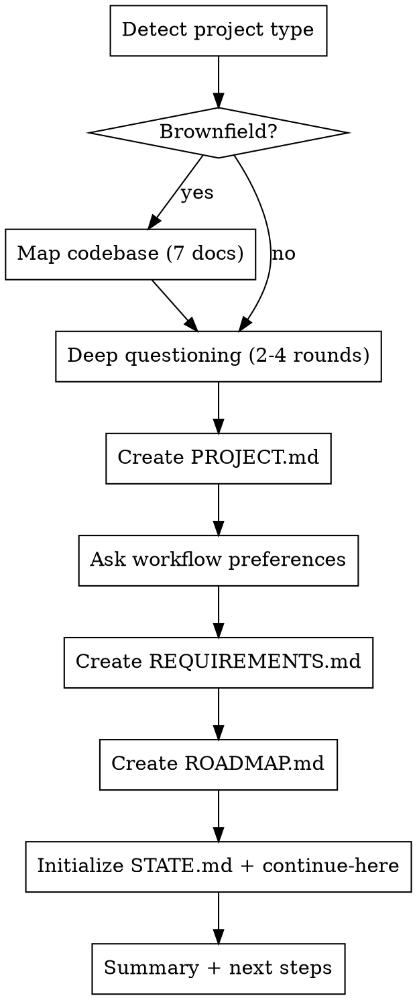

# Initialize Structured Planning

Set up a `.planning/` directory for multi-phase project planning with requirements traceability, session continuity, and wave-based parallel execution.

## When to Use

- Starting a multi-phase feature, milestone, or project
- Onboarding to a brownfield codebase that needs structured analysis
- User says "plan this project", "set up planning", or "/init-planning"

## Flow



## Step 1: Detect Project Type

Check for existing source files to determine brownfield vs greenfield:

```
Brownfield indicators: src/, lib/, app/, *.swift, *.ts, *.py, *.rs, *.go, package.json, Cargo.toml, go.mod, *.xcodeproj
Greenfield: empty directory or only config files (.gitignore, README.md, CLAUDE.md)
```

## Step 2: Codebase Mapping (Brownfield Only)

Create `.planning/codebase/` with 7 analysis documents by reading the actual codebase. Each should be concise (1-2 pages max):

| File | Purpose | Key Questions |
|------|---------|--------------|
| `ARCHITECTURE.md` | Layers, patterns, data flow | What are the layers? How does data flow? Key abstractions? |
| `STRUCTURE.md` | Directory layout, file purposes | What lives where? Naming conventions? |
| `STACK.md` | Languages, frameworks, deps, versions | What versions? Key dependencies? Build tools? |
| `CONVENTIONS.md` | Naming, code style, patterns | Established patterns to follow? Style rules? |
| `TESTING.md` | Test framework, coverage, strategy | How to run tests? What's tested? Coverage? |
| `CONCERNS.md` | Tech debt, risks, fragile areas | What's fragile? Known issues? Risky areas? |
| `INTEGRATIONS.md` | APIs, data storage, external services | External dependencies? API contracts? Data stores? |

Read broadly across the codebase — don't just look at one file. The goal is to front-load context so that phase planning is informed.

## Step 3: Deep Questioning

Use AskUserQuestion for 2-4 rounds to understand the project:

**Round 1 — Intent:**
- What's the milestone/project name?
- What's the core value — what problem does this solve?
- What does "done" look like? How will you know it's complete?

**Round 2 — Priorities:**
- What are the must-haves vs nice-to-haves?
- Known pain points or risks?
- Constraints (time, tech, team)?

**Round 3 — Boundaries:**
- What's explicitly out of scope?
- Timeline pressure?
- Testing expectations?

**Round 4 (if needed) — Technical:**
- Specific architectural decisions already made?
- Integration requirements?
- Performance targets?

Adapt the questions based on brownfield analysis (if available) — don't ask things the codebase already answers.

## Step 4: Create PROJECT.md

```markdown
# Project: [Name]

## Core Value
[One sentence: what problem this solves and for whom]

## Constraints
- [Technical, timeline, team constraints]

## Key Decisions
- [Architectural decisions made during questioning]

## Requirements Summary
- **Validated (must-have):** [count] requirements
- **Active (nice-to-have):** [count] requirements
- **Out of scope:** [list]

## Success Criteria
- [Observable outcomes that mean "done"]
```

## Step 5: Workflow Preferences

Ask the user about workflow preferences. Save to `.planning/config.json`:

```json
{
  "parallel_agents": true,
  "pause_between_phases": true,
  "verification_after_phases": true,
  "auto_commit_after_build": true
}
```

Default to all `true` — these are the recommended settings.

## Step 6: Create REQUIREMENTS.md

Group requirements by category with REQ-IDs:

```markdown
# Requirements

## Category: [Name]

| ID | Requirement | Priority | Phase | Status |
|----|-------------|----------|-------|--------|
| REQ-01 | [Description] | must-have | TBD | pending |
| REQ-02 | [Description] | must-have | TBD | pending |

## Category: [Name]

| ID | Requirement | Priority | Phase | Status |
|----|-------------|----------|-------|--------|
| REQ-03 | [Description] | nice-to-have | TBD | pending |

## Out of Scope

| Item | Reason |
|------|--------|
| [Feature] | [Why it's excluded] |

## Traceability Matrix

| REQ-ID | Phase | Plan | Status | Verified |
|--------|-------|------|--------|----------|
| *(populated during roadmap creation)* |
```

## Step 7: Create ROADMAP.md

```markdown
# Roadmap: [Milestone Name]

## Phase 1: [Name]
**Goal:** [What this phase achieves]
**Dependencies:** none
**Success criteria:** [Observable outcomes]

### Plans
- [ ] 01-01: [Plan name] — TBD
- [ ] 01-02: [Plan name] — TBD

## Phase 2: [Name]
**Goal:** [What this phase achieves]
**Dependencies:** Phase 1
**Success criteria:** [Observable outcomes]

### Plans
- [ ] 02-01: [Plan name] — TBD

## Progress

| Phase | Status | Plans | Completed |
|-------|--------|-------|-----------|
| 1 - [Name] | not started | [count] | 0 |
| 2 - [Name] | not started | [count] | 0 |
```

Plan details are TBD at this stage — they get filled in during phase planning (use `superpowers:writing-plans` with enhanced must_haves format).

## Step 8: Initialize State

Create `.planning/STATE.md`:

```markdown
# State

## Current Position
- **Phase:** not started
- **Plan:** none
- **Status:** planning complete, ready for Phase 1

## Decisions
- [Key decisions from init-planning]

## Blockers
- none
```

Create `.planning/.continue-here.md`:

```markdown
# Continue Here

## Last Workflow
init-planning

## Status
Complete — .planning/ directory initialized

## Next Action
Plan Phase 1 using superpowers:writing-plans with enhanced must_haves format.
Read templates/planning/formats.md for the PLAN.md format reference.
```

## Step 9: Summary

Present what was created:

```
.planning/ initialized:
  - PROJECT.md — project definition
  - REQUIREMENTS.md — [N] requirements tracked
  - ROADMAP.md — [N] phases defined
  - STATE.md — session continuity
  - .continue-here.md — resume point
  - config.json — workflow preferences
  [if brownfield:]
  - codebase/ — 7 analysis documents

Next step: Plan Phase 1 using superpowers:brainstorming or superpowers:writing-plans.
Use the enhanced plan format (must_haves) from templates/planning/formats.md.
```

## Integration with Superpowers

This skill creates the **project-level** planning structure. Individual plans within phases use superpowers skills:

| After init-planning... | Use this superpowers skill |
|------------------------|---------------------------|
| Plan a phase's tasks | `superpowers:writing-plans` (enhance with must_haves) |
| Execute planned tasks | `superpowers:executing-plans` or `superpowers:subagent-driven-development` |
| Run parallel work | `superpowers:dispatching-parallel-agents` (use wave assignment) |
| Verify a phase | `superpowers:verification-before-completion` (use VERIFICATION.md) |
| Complete a branch | `superpowers:finishing-a-development-branch` |
